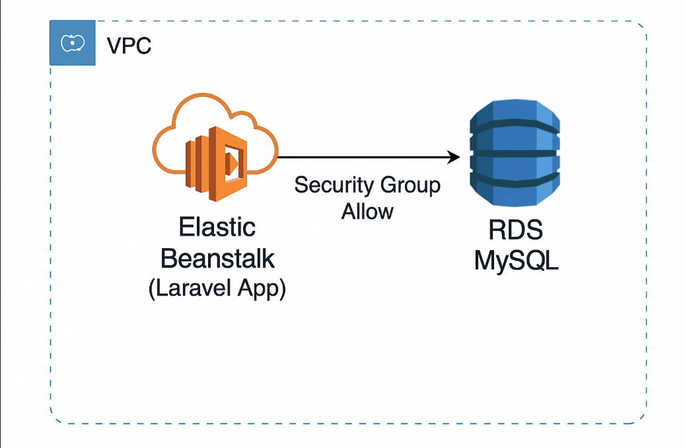
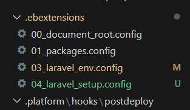
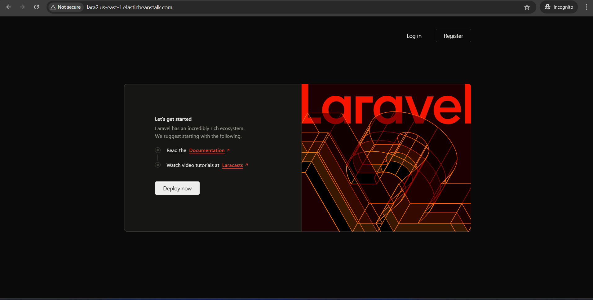
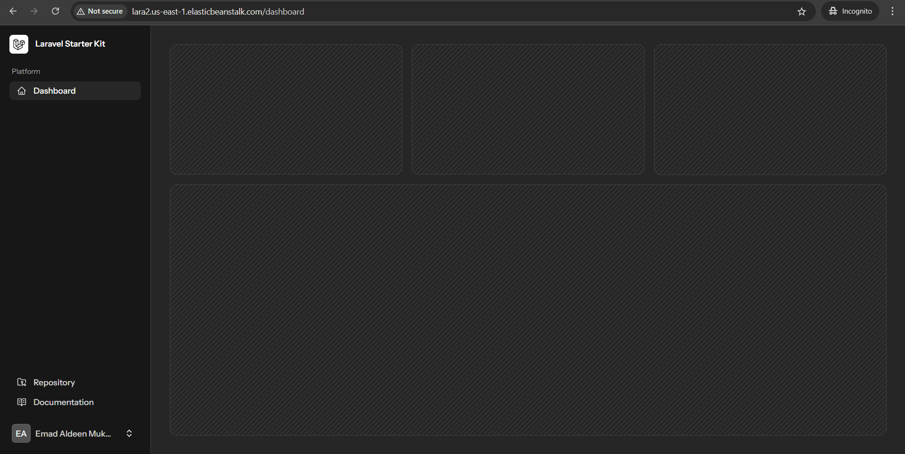

# aws-elastic-beanstalk-demo


## How to Loging and Debuging Elastic BeanStalk
- Login using command eb ssh
- And you must create the file name must be same as the key name keypairt exist or attached the elasticbeanstlak, otherwise will not connect
- Switch to /var/log/eb-engin.log
- One of the biggest thing i had noticed you should zip the entire folder content not the folder from outside. Otherwise you’ll get     issue of composer.json missing or required.
- First is EB is deploy under path /var/app/stage then will install everything and moved  to /var/app/current.
The user in Elastic BeanStalk  webapp not www-data is chown -R webapp:webapp /var/app/staging

- If you want to see the message of the ``echo ""`` command that you set in the configuration files
check this path : 
```sh
tail /var/log/cfn-init.log  -n 100
then 
tail /var/log/cfn-init-cmd.log  -n 100
```
root
N5hNSm40IFZJ107y0rCH


## How to access database from EC2 Instance of  the EB
- update RDS inbound to allow access from the security group of the ec2
- search for the mysql client ``sudo yum search mysql``
- install the package ``sudo yum install mariadb1011-client-utils.x86_64``
- install netcat utility ``yum install netcat -y``
- test the connectivity using using netcat``nc -zv your.us-east-1.rds.amazon.com 306``

## Set Env
is key value must be with sigle/double quetes key : "value"
```bash
# .ebextensions/03_laravel_env.config
option_settings:
  aws:elasticbeanstalk:application:environment:
    APP_NAME: "Larave Demo App"
    APP_ENV: "local"
    APP_KEY: "base64:nwf4NnWbUXaJj1V9BDeoIPkAx7w1mOdu77N7fVDiHos="
    APP_DEBUG: "true"
    APP_URL: "http://your-staging-url.com"
```
## EBExtensions
- You should make your conifugration files start with 0x_ and EB used as orders will start with 
lawest to the highest.
### Here is the order files of the .ebextensions



## Check DB connection
```sh
php artisan tinker
>>> DB::connection()->getPdo();
```
and you should see the object , if not that means your are not connected to the database.


root
mysql.cluoqyke6lon.us-east-1.rds.amazonaws.com
yPcKQGLY5W6XlkOJYGBc

APP_KEY=base64:nwf4NnWbUXaJj1V9BDeoIPkAx7w1mOdu77N7fVDiHos=
DB_CONNECTION=mysql
DB_HOST=mysql.cluoqyke6lon.us-east-1.rds.amazonaws.com
DB_DATABASE=laravel
DB_USERNAME=root
DB_PASSWORD=yPcKQGLY5W6XlkOJYGBc


## Porfile Page After update .env file

